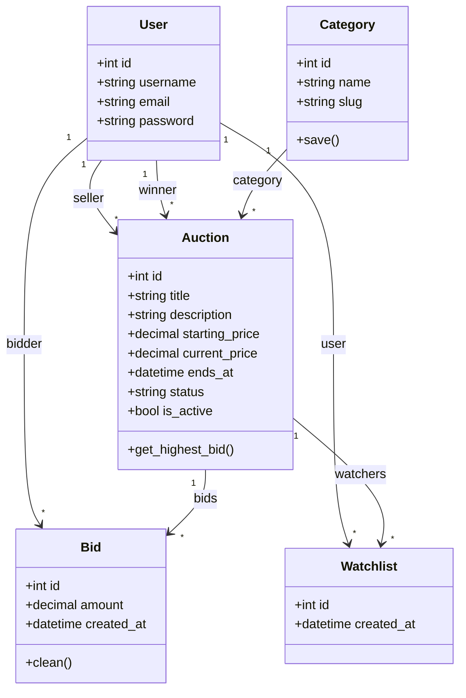

# Diagram klas — MiniAukcje

## Opis klas

| Klasa | Odpowiedzialność |
|-------|------------------|
| `User` | Model Django Auth — konto użytkownika |
| `Category` | Kategoria aukcji (Elektronika, Książki, …) |
| `Auction` | Ogłoszenie aukcyjne ze statusem i ceną |
| `Bid` | Pojedyncza oferta licytacyjna |
| `Watchlist` | Powiązanie użytkownik ↔ obserwowana aukcja |
