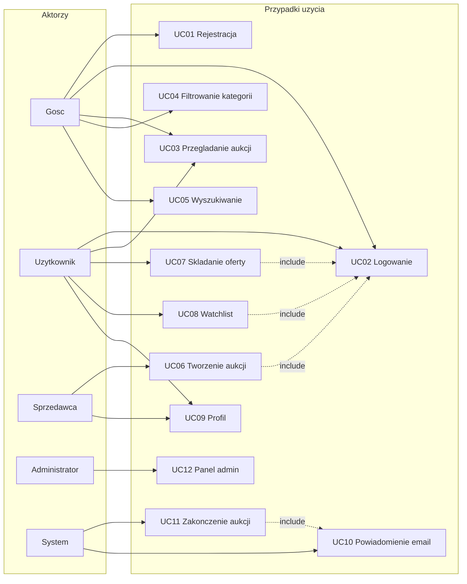

# Diagram przypadków użycia — MiniAukcje

## Legenda relacji

- **include** (linia przerywana): przypadek bazowy wymaga wykonania innego UC
- Sprzedawca i Użytkownik dziedziczą po roli zarejestrowanego użytkownika
