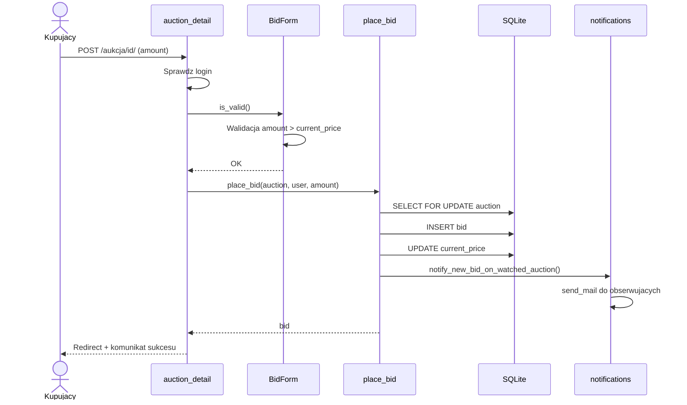

# Diagram sekwencji — składanie oferty

## Kroki

1. Użytkownik wysyła formularz z kwotą oferty.
2. Widok sprawdza autentykację i waliduje formularz.
3. Serwis `place_bid` w transakcji zapisuje ofertę i aktualizuje cenę.
4. Moduł powiadomień wysyła e-mail do obserwujących.
5. Użytkownik wraca na stronę aukcji z komunikatem.
