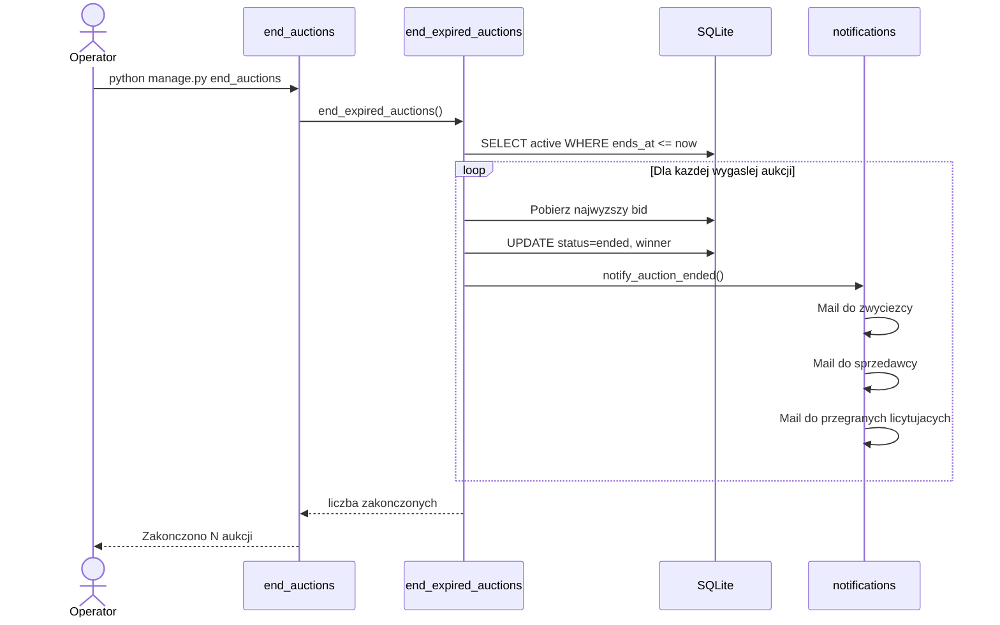

# Diagram sekwencji — zakończenie aukcji

```mermaid
sequenceDiagram
    actor Admin as Operator
    participant Cmd as end_auctions
    participant Service as end_expired_auctions
    participant DB as SQLite
    participant Notify as notifications

    Admin->>Cmd: python manage.py end_auctions
    Cmd->>Service: end_expired_auctions()
    Service->>DB: SELECT active WHERE ends_at <= now
    loop Dla kazdej wygaslej aukcji
        Service->>DB: Pobierz najwyzszy bid
        Service->>DB: UPDATE status=ended, winner
        Service->>Notify: notify_auction_ended()
        Notify->>Notify: Mail do zwyciezcy
        Notify->>Notify: Mail do sprzedawcy
        Notify->>Notify: Mail do przegranych licytujacych
    end
    Service-->>Cmd: liczba zakonczonych
    Cmd-->>Admin: Zakonczono N aukcji
```

## Uwagi

- Command może być uruchamiany ręcznie lub z crona.
- Dodatkowo `end_expired_auctions()` wywoływane jest przy wejściu na listę/szczegóły aukcji.
